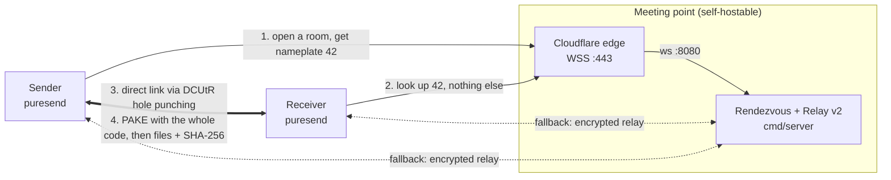

# PureSend 📦 · [Türkçe](README_TR.md)

> **An end-to-end encrypted peer-to-peer (P2P) file transfer tool written in Go.**  
> No cloud storage, no accounts. Two devices behind home routers (NAT) connect directly whenever a hole can be punched; where it cannot, the transfer continues through a relay, still encrypted end to end.

[](https://github.com/Baaaki/PureSend/actions)
[](https://go.dev/)
[](LICENSE)
[](https://github.com/Baaaki/PureSend/releases/latest)

**[Website](https://puresend.madebybaki.com)** · **[Download](https://github.com/Baaaki/PureSend/releases/latest)** · **[Engineering Deep Dive →](https://madebybaki.com/how-i-built-puresend)**

---

## 🎬 Demo

<!-- Demo GIF / screenshot goes here, e.g.  -->

Two terminals, no accounts, no open ports:

```bash
# Terminal A: the sender. The room code is printed on its own line.
puresend -send ./holiday-photos/

# Terminal B: the receiver, anywhere on the internet.
puresend -receive kiraz-liman-42
```

Or just run `puresend` for the interactive terminal UI (Turkish / English, switch with `[L]`).

---

## 🎯 Key Features

* 🔒 **No Need to Trust the Server:** The secret words of a code never reach the rendezvous server, so with the **PAKE** handshake it can neither read transfers nor put itself in the middle without guessing them.
* ⚡ **Intelligent NAT Traversal (P2P):** **libp2p (DCUtR)** direct device-to-device streaming without open ports (Relay v2 fallback).
* 🔄 **Resilience & Resumability:** Interrupted transfers resume from the last byte; every file is verified with SHA-256 once complete.
* 💻 **TUI & CLI Automation:** Interactive bilingual terminal UI (`Bubble Tea`) or headless automation flags (`-send`, `-receive`).

---

## 🏗️ Architecture



1. **Discovery:** The sender gets a room number from the server (`42`) and puts two secret words of its own in front of it: `kiraz-liman-42`. The server only ever knows the number.
2. **Direct Connection:** The first connection runs through the server's relay; **DCUtR** then tries to replace it with a direct one. Where no hole can be punched (a symmetric NAT, for instance) the transfer stays on the relay, encrypted end to end, limited in size and duration.
3. **Authentication:** Both peers run a **PAKE** handshake with the whole code as the password, and bind both peer IDs into the key, so a server that never saw the words cannot sit in between. Three wrong codes close the room.
4. **Verified Transfer:** Files stream in chunks over the encrypted connection; each is checked against its SHA-256 once complete.

Full sequence diagrams and the fallback decision tree: [docs/ARCHITECTURE.md](docs/ARCHITECTURE.md).

### 🛠️ Tech Stack

| Area | Technologies |
| :--- | :--- |
| **Language & Runtime** | Go (Golang 1.27) — `CGO_ENABLED=0` (standalone static binary, zero runtime dependencies) |
| **Networking & Protocols** | libp2p (v0.50), WebSockets, TLS, DCUtR (Hole Punching), Circuit Relay v2, STUN (pion/stun v4.0.1), UPnP |
| **Cryptography** | PAKE (`schollz/pake` v3, SPAKE2-style, P-256), Noise / TLS 1.3, per-file SHA-256, minisign-signed releases, Govulncheck |
| **Interface (TUI)** | Charmbracelet Bubble Tea (v2.0 - Elm Architecture), Lip Gloss (v2.0) |
| **DevOps & Packaging** | GoReleaser (v2), GitHub Actions CI/CD, Debian (`.deb`), Arch Linux (`PKGBUILD`), One-Line Installer (`sh`/`ps1`) |

---

## 🧭 Why This Architecture?

* **The server is a matchmaker, not a trusted party.** Only the nameplate (`42`) reaches it; the secret words (`kiraz-liman`) enter the PAKE handshake alone. A compromised server cannot read or swap a transfer without guessing them: at most 3 guesses in 65,536 per room.
* **Direct first, relay as insurance.** libp2p brings DCUtR hole punching, Circuit Relay v2 and Noise / TLS 1.3 in one stack, so data goes device to device whenever it can, and the relay only ever carries ciphertext it cannot read.
* **Constant memory.** Files stream in 32 KB chunks and are never loaded whole: peak RSS stays at 33–39 MB from 256 MiB up to 8 GiB.
* **No static IP, no open ports.** The server speaks libp2p over WebSocket, so it sits behind a plain Cloudflare Tunnel, which proxies only HTTP(S) and WebSocket (UDP/QUIC cannot be exposed through it, raw public TCP would need Spectrum).
* **One static binary.** `CGO_ENABLED=0`: no runtime dependencies, with the installers, a `.deb` and an AUR package on top.

### ⚖️ Trade-offs

| Decision | Instead of | What it costs |
| :--- | :--- | :--- |
| Short, speakable code: 16-bit secret + 3-guess lockout | Long random codes | At most 3 in 65,536 per room, and a stranger who walks nameplates can close rooms on purpose (one new code to read out) |
| Relay capped at 256 MB / 10 min per connection | Unbounded relay | A transfer larger than the cap cannot finish when no hole can be punched; the receiver is warned before it starts |
| DEFLATE `HuffmanOnly` per 32 KB chunk (~800 MB/s) | Heavier compression | Lower ratio; a chunk that does not shrink is sent as is |
| WebSocket through a Cloudflare Tunnel | An open TCP/UDP port | Every client shares the tunnel's address, so per-address limits must live at the edge; the server's own limits only slow a flood down |
| `schollz/pake`, a SPAKE2-style exchange | A standardized PAKE (RFC 9382 SPAKE2, CPace) | The library has had far less review than the standards; the parts that carry the security (binding both identities, mutual confirmation tags) are this project's own code (`internal/transfer/auth.go`) |

> For an in-depth dive into our architectural decisions, benchmark methodology, and production trade-offs, read the [Engineering Deep Dive article →](https://madebybaki.com/how-i-built-puresend)

---

## ⚡ Quick Start

### Install

Run the one-line installer for your platform to install and integrate PureSend into your PATH:

```bash
# Linux & macOS (Arch, Ubuntu, Fedora, Debian, macOS, etc.)
curl -fsSL https://raw.githubusercontent.com/Baaaki/PureSend/main/install.sh | sh

# Windows (PowerShell)
irm https://raw.githubusercontent.com/Baaaki/PureSend/main/install.ps1 | iex
```

> **Portable Binaries:** Prebuilt standalone executables (`.exe`, `mac_arm64`, and `.deb`) are available directly from [GitHub Releases](https://github.com/Baaaki/PureSend/releases/latest) and the [Project Website](https://puresend.madebybaki.com/#indir).

### Use

**Interactive Terminal UI**

```bash
puresend
```
* **Send:** Select files or directories $\rightarrow$ Share the generated code (e.g. `kiraz-liman-42`).
* **Receive:** Enter the code $\rightarrow$ Confirm transfer (files save into `Downloads/PureSend`).
* **Language:** Press `[L]` to switch between English and Turkish at any time.

**Headless CLI (scripts and automation)**

```bash
# Send directory in the background
puresend -send ./backups/

# Receive code into a target directory non-interactively
puresend -receive kiraz-liman-42 -out /var/data -yes

# In-place self-update to latest release
puresend -update
```

Exit codes are stable for scripting: `0` success, `2` bad flags, `3` network unreachable, `4` wrong code or expired room, `5` transfer declined, `6` I/O or checksum error, `130` interrupted.

### Build from source

```bash
git clone https://github.com/Baaaki/PureSend.git && cd PureSend
make build    # ./bin/puresend and ./bin/puresend-server (Go 1.27+)
make dev      # a local meeting point; point clients at the address it prints
./bin/puresend -server <address-it-printed>
```

A source build has no public server baked in, which is why `-server` is needed (or `FT_SERVER`). Release binaries carry the default one.

### Test

```bash
make test           # go vet + the whole suite with the race detector
make cover          # merged coverage report, client binary included (~77%)
make lint           # golangci-lint, the same version CI runs
make vuln           # reachable known vulnerabilities (govulncheck)
make test-relay     # relay fallback over isolated networks (no root needed)
make test-holepunch # direct connection through routers that move ports
make bench-e2e      # end-to-end throughput and memory
```

CI runs on every commit: a `gofmt` check, `go vet`, the whole suite under the race detector, golangci-lint, govulncheck, a health check of the server's Docker image, the relay-fallback test over isolated network namespaces where the two peers cannot see each other at all, and the hole-punching test behind routers that rewrite ports.

---

## 📈 Benchmarks

Every number below was measured; the method and every individual run are in [docs/BENCHMARK.md](docs/BENCHMARK.md). Measured on v2.0.7. Hardware: AMD Ryzen 7 5700X, NVMe disk, Linux 6.8, Go 1.27.

| Measurement | Result | How |
| :--- | :---: | :--- |
| **End-to-end throughput** | **270–440 MB/s** | Real server, sender and receiver processes on loopback; 256 MiB–8 GiB of random data over the encrypted libp2p connection, SHA-256 on both ends, written to disk (`make bench-e2e`) |
| **Peak memory (RSS)** | **33–39 MB** | Same runs; flat from 256 MiB to 8 GiB |
| **Handshake (CPU)** | **~0.65 ms** | Both sides' PAKE and confirmation steps together (`BenchmarkHandshake`); on a real connection, network round trips dominate |
| **Compression** | **~800 MB/s** | Text-like 32 KB chunks, DEFLATE `HuffmanOnly`; a chunk that does not shrink is sent as is |

| Before → After | Result |
| :--- | :--- |
| Hole punching behind a router that moves ports (`make test-holepunch`, run by CI) | v2.0.4: the relay carried the files → v2.0.5: direct connection |

**What it means:** loopback has no wire speed of its own, so this measures the ceiling the software sets. Even the slowest run (269 MB/s) is more than twice gigabit Ethernet (~118 MB/s): on this hardware the LAN, not PureSend, is the bottleneck. Runs vary a lot on a busy desktop, which is why a range is shown; v2.0.0 binaries measured in the same session fall in the same range. A slower CPU or disk lowers the ceiling. Over the internet, speed is bounded by the two ends' connections, and on the relay by the server's limits.

> Test methodology, profiling and the story behind these numbers: [Engineering Deep Dive article →](https://madebybaki.com/how-i-built-puresend)

---

## 🚀 Deployment

* **Clients:** a push of a `v*` tag runs `go vet` and the race-detector tests, then GoReleaser builds Linux x86_64, macOS arm64 and Windows x86_64 binaries plus a `.deb`, and publishes them to GitHub Releases. `checksums.txt` is signed with minisign; `puresend -update` and the installers verify it. A published release is never replaced.
* **Meeting point:** one container (rendezvous + Circuit Relay v2) behind a Cloudflare Tunnel, which terminates TLS on 443 and forwards plain WebSocket to port 8080. Read-only filesystem, all capabilities dropped, `no-new-privileges`, non-root user; `/health` and Prometheus `/metrics` listen on `127.0.0.1:8081` only.
* **Run your own:**

```bash
PUBLIC_HOST=p2p.example.com docker compose up -d
docker compose logs rendezvous | grep "Peer ID"   # clients need this to dial the server
```

Reverse-proxy options (Cloudflare Tunnel, Caddy, Nginx), per-IP rate limits at the edge, key backup and the release procedure: [docs/DEPLOYMENT.md](docs/DEPLOYMENT.md).

---

## 🚧 Limitations

* **Prebuilt binaries:** Linux x86_64, macOS Apple Silicon (arm64) and Windows x86_64. Linux ARM64 and Intel Macs build from source and need `-server`.
* **Relay limits:** where hole punching fails (symmetric NAT, some CGNAT), the relay carries at most 256 MB or 10 minutes per connection on the default server. Larger transfers cannot finish there.
* **Not measured yet:** hole-punching success rate across real home, mobile (CGNAT) and corporate network pairs; speed on a real gigabit / 2.5G LAN; speed through the relay. The throughput above is a loopback ceiling, not an internet figure.
* **Not an anonymity tool:** the server sees IP addresses, peer IDs and which peers meet. A waiting sender's addresses go to anyone who looks up its nameplate, and libp2p shares addresses between connected peers even over the relay. File names, sizes and contents stay hidden from the server.
* **The code is the authorization:** anyone who learns it before the intended receiver uses it can claim the room, so share it over a channel you trust. The 16-bit secret is bounded by the 3-guess lockout, not made unguessable.
* **No content scanning:** a matching SHA-256 proves the file is the one the sender offered, not that it is safe to open.
* **Unsigned by OS vendors:** binaries carry no Apple or Microsoft code-signing certificate, so Gatekeeper and SmartScreen warn on first launch.
* **Floods are throttled, not stopped, by the server itself:** with every client behind one tunnel address, per-address limits belong at the edge (rules in [docs/DEPLOYMENT.md](docs/DEPLOYMENT.md)).
* **One default meeting point:** release binaries carry a single server address. If it changes, installed clients find the new one through the published `server.txt`; or run your own server and pass `-server`.

Full threat model, what is and is not protected: [SECURITY.md](.github/SECURITY.md).

---

## 📂 Project Layout

```
├── cmd/
│   ├── client/          # Terminal application (TUI & Headless CLI entry point)
│   └── server/          # Rendezvous & Circuit Relay v2 server daemon
├── internal/
│   ├── p2p/             # libp2p host lifecycle, multi-address listener, dynamic relay fallback
│   ├── rendezvous/      # Room nameplate protocol and the code word list
│   ├── headless/        # Send / receive without a terminal UI, for scripts
│   ├── transfer/        # PAKE handshake, chunk streaming & resumable transfers
│   ├── tui/             # Bubble Tea models, formatters, and keyboard navigation
│   ├── i18n/            # OS locale detection & localization dictionary (TR/EN)
│   ├── update/          # In-place self-updater querying GitHub Releases
│   └── safetext/        # Terminal escape sequence and bidirectional override sanitization
├── packaging/           # Arch Linux PKGBUILD, .desktop files, and SVG branding
├── scripts/             # .deb packaging and the end-to-end benchmark
└── test/
    ├── relay/           # Relay fallback test over isolated network namespaces
    └── holepunch/       # Hole punching test behind routers that move ports
```

---

## 📄 License & Contact

Distributed under the [GNU General Public License v3.0](LICENSE).

* **Website:** [https://puresend.madebybaki.com](https://puresend.madebybaki.com)
* **Engineering article:** [madebybaki.com/how-i-built-puresend](https://madebybaki.com/how-i-built-puresend)
* **Contact:** [contact@madebybaki.com](mailto:contact@madebybaki.com)
* **Changelog:** [CHANGELOG.md](docs/CHANGELOG.md)
* **Security Policy:** [SECURITY.md](.github/SECURITY.md)
* **Contributing Guide:** [CONTRIBUTING.md](.github/CONTRIBUTING.md)
