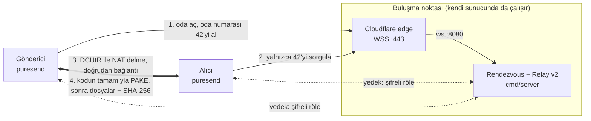

# PureSend 📦 · [English](README.md)

> **Go (Golang) ile geliştirilmiş, uçtan uca şifreli ve doğrudan eşler arası (P2P) dosya transfer sistemi.**  
> Bulut depolamaya ve üyeliğe gerek yok. Ev modemi (NAT) arkasındaki iki cihaz mümkün olduğunda doğrudan bağlanır; delik açılamayan ağlarda aktarım yine şifreli olarak bir röle üzerinden sürer.

[](https://github.com/Baaaki/PureSend/actions)
[](https://go.dev/)
[](LICENSE)
[](https://github.com/Baaaki/PureSend/releases/latest)

**[Web Sitesi](https://puresend.madebybaki.com)** · **[İndir](https://github.com/Baaaki/PureSend/releases/latest)** · **[Mühendislik Makalesi →](https://madebybaki.com/puresend-nasil-yapildi)**

---

## 🎬 Demo

<!-- Demo GIF / ekran görüntüsü buraya, örn.  -->

İki terminal, üyelik yok, açık port yok:

```bash
# Terminal A: gönderici. Oda kodu kendi satırında yazdırılır.
puresend -send ./tatil-fotograflari/

# Terminal B: alıcı, internetin herhangi bir yerinde.
puresend -receive kiraz-liman-42
```

Ya da etkileşimli terminal arayüzü için yalnızca `puresend` çalıştırın (Türkçe / İngilizce, `[L]` ile geçiş).

---

## 🎯 Öne Çıkan Özellikler

* 🔒 **Sunucuya Güvenmek Gerekmez:** Kodun gizli kelimeleri sunucuya hiç gitmez; **PAKE** el sıkışması sayesinde sunucu veriyi göremez ve kelimeleri tahmin etmeden araya giremez.
* ⚡ **Akıllı NAT Delme (P2P):** **libp2p (DCUtR)** ile port açmadan doğrudan cihazdan cihaza aktarım (gerekirse Relay v2 yedeği).
* 🔄 **Kesintisiz Devam (Resume):** Kopan transferler kaldığı bayttan devam eder; her dosya bitince SHA-256 ile doğrulanır.
* 💻 **TUI & CLI Desteği:** Etkileşimli çift dilli terminal arayüzü (`Bubble Tea`) veya otomasyon için bayraklar (`-send`, `-receive`).

---

## 🏗️ Mimari



1. **Buluşma (Discovery):** Gönderici sunucudan bir oda numarası alır (`42`) ve önüne kendi seçtiği iki gizli kelimeyi koyar: `kiraz-liman-42`. Sunucu yalnızca numarayı bilir.
2. **Doğrudan Bağlantı:** İlk bağlantı sunucunun rölesi üzerinden kurulur; **DCUtR** bunu doğrudan bir bağlantıyla değiştirmeye çalışır. Simetrik NAT gibi delik açılamayan durumlarda aktarım röle üzerinden (uçtan uca şifreli, boyut ve süre sınırlı) devam eder.
3. **Kimlik Doğrulama:** Eşler kodun tamamını ortak parola olarak kullanıp bir **PAKE** el sıkışmasıyla birbirlerini doğrular; iki tarafın peer ID'si de anahtara bağlanır, bu yüzden kelimeleri bilmeyen sunucu araya giremez. Yanlış kodla 3 denemeden sonra oda kapanır.
4. **Doğrulanmış Aktarım:** Dosyalar şifreli bağlantı üzerinden dilim dilim iletilir; her dosya bitince SHA-256 ile doğrulanır.

Ayrıntılı sıralı akış diyagramları ve yedek yol karar ağacı: [docs/ARCHITECTURE_TR.md](docs/ARCHITECTURE_TR.md).

### 🛠️ Teknoloji Yığını (Tech Stack)

| Alan | Teknolojiler |
| :--- | :--- |
| **Programlama Dili** | Go (Golang 1.27) — `CGO_ENABLED=0` (tamamen bağımsız statik ikili dosyalar) |
| **Ağ & Eşler Arası (P2P)** | libp2p (v0.50), WebSockets, TLS, DCUtR (Hole Punching), Circuit Relay v2, STUN (pion/stun v4.0.1), UPnP |
| **Güvenlik & Kriptografi** | PAKE (`schollz/pake` v3, SPAKE2 tarzı, P-256), Noise / TLS 1.3, dosya başına SHA-256, minisign imzalı sürümler, Govulncheck |
| **Kullanıcı Arayüzü** | Charmbracelet Bubble Tea (v2.0 - Elm Mimarisi), Lip Gloss (v2.0) |
| **Dağıtım & DevOps** | GoReleaser (v2), GitHub Actions CI/CD, Debian (`.deb`), Arch Linux (`PKGBUILD`), Tek Satır Kurulumcu (`sh`/`ps1`) |

---

## 🧭 Neden Bu Mimari?

* **Sunucu bir görücüdür, güvenilen taraf değil.** Ona yalnızca oda numarası (`42`) gider; gizli kelimeler (`kiraz-liman`) sadece PAKE el sıkışmasına girer. Ele geçirilmiş bir sunucu, kelimeleri tahmin etmeden bir transferi okuyamaz ya da değiştiremez: oda başına 65.536'da en fazla 3 tahmin.
* **Önce doğrudan, röle sigorta olarak.** libp2p, DCUtR delik açma, Circuit Relay v2 ve Noise / TLS 1.3'ü tek yığında getirir; veri mümkün olduğunda cihazdan cihaza gider, röle ise yalnızca okuyamadığı şifreli veriyi taşır.
* **Sabit bellek.** Dosyalar 32 KB'lık dilimlerle akar, hiçbir zaman bütün olarak belleğe alınmaz: tepe RSS, 256 MiB'dan 8 GiB'a kadar 33–39 MB'da kalır.
* **Sabit IP yok, açık port yok.** Sunucu libp2p'yi WebSocket üzerinden konuşur; bu yüzden yalnızca HTTP(S) ve WebSocket vekilleyen sade bir Cloudflare Tunnel arkasında çalışır (UDP/QUIC bu yolla açılamaz, genel ağa açık ham TCP için Spectrum gerekir).
* **Tek statik ikili dosya.** `CGO_ENABLED=0`: çalışma zamanı bağımlılığı yok; üstüne kurulum betikleri, `.deb` ve AUR paketi geliyor.

### ⚖️ Ödünleşimler (Trade-offs)

| Karar | Yerine | Bedeli |
| :--- | :--- | :--- |
| Kısa, söylenebilir kod: 16 bitlik gizli kısım + 3 tahminlik kilit | Uzun rastgele kodlar | Oda başına 65.536'da en fazla 3 şans; oda numaralarını tarayan biri odaları bilerek kapatabilir (gönderici yeni bir kod okur) |
| Röle bağlantı başına 256 MB / 10 dk ile sınırlı | Sınırsız röle | Delik açılamazsa sınırdan büyük bir transfer bitemez; alıcı başlamadan önce uyarılır |
| 32 KB dilim başına DEFLATE `HuffmanOnly` (~800 MB/s) | Daha ağır sıkıştırma | Daha düşük oran; küçülmeyen dilim olduğu gibi gönderilir |
| Cloudflare Tunnel üzerinden WebSocket | Açık bir TCP/UDP portu | Bütün istemciler tünelin adresinden gelir; adres başına sınırlar kenar katmanında olmalı, sunucunun kendi sınırları seli yalnızca yavaşlatır |
| `schollz/pake`, SPAKE2 tarzı bir değişim | Standartlaşmış bir PAKE (RFC 9382 SPAKE2, CPace) | Kütüphane standartlardan çok daha az incelenmiştir; güvenliği taşıyan kısımlar (iki kimliğin anahtara bağlanması, karşılıklı onay etiketleri) projenin kendi kodu (`internal/transfer/auth.go`) |

> Mimari kararların, ölçüm yönteminin ve production'daki ödünleşimlerin derinlemesine anlatımı için [Mühendislik Makalesi →](https://madebybaki.com/puresend-nasil-yapildi) yazısını okuyun.

---

## ⚡ Hızlı Başlangıç

### Kurulum

İşletim sisteminize uygun tek satırlık komutu terminalde çalıştırarak anında kurabilir ve güncelleyebilirsiniz:

```bash
# Linux & macOS (Arch, Ubuntu, Fedora, Debian, macOS vb.)
curl -fsSL https://raw.githubusercontent.com/Baaaki/PureSend/main/install.sh | sh

# Windows (PowerShell)
irm https://raw.githubusercontent.com/Baaaki/PureSend/main/install.ps1 | iex
```

> **Klasik İndirme:** Kurulum yapmadan taşınabilir (portable) çalıştırmak için [GitHub Releases](https://github.com/Baaaki/PureSend/releases/latest) veya [Web Sitemizden](https://puresend.madebybaki.com/#indir) doğrudan `.exe`, `mac_arm64` veya `.deb` dosyalarını indirebilirsiniz.

### Kullanım

**Etkileşimli Terminal Arayüzü (TUI)**

```bash
puresend
```
* **Gönder:** Dosya veya klasörleri seçin $\rightarrow$ Ekranda çıkan kodu (örn. `kiraz-liman-42`) alıcıya verin.
* **Al:** Kodu girin $\rightarrow$ Aktarımı onaylayın (dosyalar otomatik olarak `İndirilenler/PureSend` dizinine kaydedilir).
* **Dil:** `[L]` tuşuna basarak anında Türkçe / İngilizce arasında geçiş yapın.

**Otomasyon ve Betikler İçin CLI Modu**

```bash
# Belirtilen dizini arka planda gönder
puresend -send ./belgeler/

# Kodu doğrudan hedef dizine indir ve onay istemeden tamamla
puresend -receive kiraz-liman-42 -out /var/backups -yes

# En son sürüme güncelle
puresend -update
```

Çıkış kodları betikler için sabittir: `0` başarı, `2` hatalı bayrak, `3` ağa ulaşılamadı, `4` yanlış kod ya da süresi dolmuş oda, `5` transfer reddedildi, `6` G/Ç ya da sağlama hatası, `130` kesildi.

### Kaynaktan Derleme

```bash
git clone https://github.com/Baaaki/PureSend.git && cd PureSend
make build    # ./bin/puresend ve ./bin/puresend-server (Go 1.27+)
make dev      # yerel bir buluşma sunucusu; istemcileri yazdığı adrese yönlendirin
./bin/puresend -server <yazdirilan-adres>
```

Kaynaktan derlenen ikili dosyaya herkese açık bir sunucu gömülü değildir; bu yüzden `-server` (ya da `FT_SERVER`) gerekir. Sürüm ikili dosyaları varsayılan sunucuyla gelir.

### Test

```bash
make test           # go vet + race detector ile tüm testler
make cover          # birleşik kapsama raporu, binary dahil (~%77)
make lint           # golangci-lint, CI ile aynı sürüm
make vuln           # erişilebilir bilinen açıklar (govulncheck)
make test-relay     # röle yedeği, izole ağlarda (root gerekmez)
make test-holepunch # portları değiştiren modemlerin arkasında doğrudan bağlantı
make bench-e2e      # uçtan uca hız ve bellek ölçümü
```

CI her commit'te şunları çalıştırır: `gofmt` denetimi, `go vet`, race detector ile tüm testler, golangci-lint, govulncheck, sunucu Docker imajının sağlık kontrolü, iki eşin birbirini hiç göremediği izole network namespace'lerde röle yedeği testi ve portları yeniden yazan modemlerin arkasında delik açma testi.

---

## 📈 Performans (Benchmarks)

Aşağıdaki sayılar ölçüldü; yöntem ve tek tek bütün çalıştırmalar [docs/BENCHMARK_TR.md](docs/BENCHMARK_TR.md) içinde. v2.0.7 üzerinde ölçüldü. Donanım: AMD Ryzen 7 5700X, NVMe disk, Linux 6.8, Go 1.27.

| Ölçüm | Sonuç | Nasıl |
| :--- | :---: | :--- |
| **Uçtan uca aktarım hızı** | **270–440 MB/s** | Gerçek sunucu + gönderici + alıcı süreçleri, loopback üzerinde; 256 MiB–8 GiB rastgele veri, şifreli libp2p bağlantısı, iki uçta SHA-256, diske yazma (`make bench-e2e`) |
| **Tepe bellek (RSS)** | **33–39 MB** | Aynı ölçümde; 256 MiB ile 8 GiB arasında dosya boyutuyla değişmiyor |
| **El sıkışma (CPU)** | **~0,65 ms** | İki tarafın PAKE ve onay adımları birlikte (`BenchmarkHandshake`); gerçek bir bağlantıda ağ gidiş-dönüşleri baskındır |
| **Sıkıştırma** | **~800 MB/s** | Metin benzeri 32 KB dilim, DEFLATE `HuffmanOnly`; küçülmeyen dilim olduğu gibi gönderilir |

| Önce → Sonra | Sonuç |
| :--- | :--- |
| Portları değiştiren bir modemin arkasında delik açma (`make test-holepunch`, CI'da çalışır) | v2.0.4: dosyaları röle taşıdı → v2.0.5: doğrudan bağlantı |

**Ne anlama geliyor:** Loopback'in kendi hat hızı yoktur, bu yüzden bu ölçüm yazılımın koyduğu tavanı gösterir. En yavaş çalıştırma bile (269 MB/s) gigabit Ethernet'in (~118 MB/s) iki katından fazladır, yani bu donanımda yerel ağdaki darboğaz PureSend değil ağın kendisidir. Yoğun bir masaüstünde çalıştırmalar arasında fark büyüktür; bu yüzden aralık gösterilir, aynı oturumda ölçülen v2.0.0 ikili dosyaları da aynı aralığa düşer. Daha yavaş bir işlemci ya da diskte tavan düşer. İnternet üzerinden hız iki ucun bağlantısıyla, röle yedeğinde ise sunucunun koyduğu sınırlarla belirlenir.

> Test metodolojisi, profilleme ve bu sayıların arkasındaki hikâye: [Mühendislik Makalesi →](https://madebybaki.com/puresend-nasil-yapildi)

---

## 🚀 Dağıtım (Deployment)

* **İstemciler:** `v*` etiketi itildiğinde `go vet` ve race detector'lü testler çalışır, ardından GoReleaser Linux x86_64, macOS arm64 ve Windows x86_64 ikili dosyalarını bir `.deb` ile birlikte derleyip GitHub Releases'e yükler. `checksums.txt` minisign ile imzalanır; `puresend -update` ve kurulum betikleri bunu doğrular. Yayınlanmış bir sürüm asla değiştirilmez.
* **Buluşma noktası:** Cloudflare Tunnel arkasında tek bir konteyner (rendezvous + Circuit Relay v2). Tünel TLS'i 443'te sonlandırır ve düz WebSocket'i 8080 portuna iletir. Salt-okunur dosya sistemi, bütün yetkiler (capabilities) düşürülmüş, `no-new-privileges`, root olmayan kullanıcı; `/health` ve Prometheus `/metrics` yalnızca `127.0.0.1:8081` üzerinde dinler.
* **Kendi sunucunu çalıştır:**

```bash
PUBLIC_HOST=p2p.alanadiniz.com docker compose up -d
docker compose logs rendezvous | grep "Peer ID"   # istemcilerin sunucuya bağlanması için gerekli
```

Ters vekil seçenekleri (Cloudflare Tunnel, Caddy, Nginx), kenarda IP başına hız sınırı, anahtar yedekleme ve sürüm yayınlama adımları: [docs/DEPLOYMENT_TR.md](docs/DEPLOYMENT_TR.md).

---

## 🚧 Sınırlamalar (Limitations)

* **Hazır ikili dosyalar:** Linux x86_64, macOS Apple Silicon (arm64) ve Windows x86_64. Linux ARM64 ve Intel Mac için kaynaktan derlemek ve `-server` vermek gerekir.
* **Röle sınırları:** Delik açılamadığında (simetrik NAT, bazı CGNAT'lar) varsayılan sunucuda röle bağlantı başına en fazla 256 MB ya da 10 dakika taşır. Daha büyük transferler orada bitemez.
* **Henüz ölçülmeyenler:** Gerçek ev, mobil (CGNAT) ve kurumsal ağ çiftlerinde delik açma başarı oranı; gerçek bir gigabit / 2,5G yerel ağda hız; röle üzerinden hız. Yukarıdaki aktarım hızı bir loopback tavanıdır, internet rakamı değildir.
* **Anonimlik aracı değildir:** Sunucu IP adreslerini, peer ID'leri ve hangi eşlerin buluştuğunu görür. Bekleyen bir göndericinin adresleri, oda numarasını sorgulayan herkese gider; libp2p bağlı eşlere adresleri röle üzerinden bile bildirir. Dosya adları, boyutlar ve içerik sunucudan gizli kalır.
* **Kod, yetkinin kendisidir:** Kodu, asıl alıcıdan önce öğrenen biri odayı sahiplenebilir; bu yüzden güvendiğiniz bir kanaldan paylaşın. 16 bitlik gizli kısım tahmin edilemez kılınmaz, 3 tahminlik kilitle sınırlanır.
* **İçerik taranmaz:** SHA-256'nın eşleşmesi dosyanın göndericinin sunduğu dosya olduğunu kanıtlar; açmanın güvenli olduğunu değil.
* **İşletim sistemi imzası yok:** İkili dosyalar Apple ya da Microsoft kod imzalama sertifikası taşımaz; Gatekeeper ve SmartScreen ilk açılışta uyarır.
* **Bağlantı seli sunucunun kendi sınırlarıyla durdurulmaz, yalnızca yavaşlatılır:** Bütün istemciler tek bir tünel adresinin arkasında olduğundan adres başına sınırların yeri kenar katmanıdır (kurallar [docs/DEPLOYMENT_TR.md](docs/DEPLOYMENT_TR.md) içinde).
* **Tek varsayılan buluşma noktası:** Sürüm ikili dosyaları tek bir sunucu adresi taşır. Adres değişirse kurulu istemciler yenisini yayınlanan `server.txt` üzerinden bulur; ya da kendi sunucunuzu çalıştırıp `-server` verirsiniz.

Tehdit modelinin tamamı, nelerin korunduğu ve nelerin korunmadığı: [SECURITY.md](.github/SECURITY.md) (İngilizce).

---

## 📂 Proje Dizin Mimarisi

```
├── cmd/
│   ├── client/          # Terminal istemcisi (TUI + Headless CLI giriş noktası)
│   └── server/          # Rendezvous & Circuit Relay v2 buluşma sunucusu
├── internal/
│   ├── p2p/             # libp2p host yönetimi, çoklu sunucu ve dinamik liste senkronizasyonu
│   ├── rendezvous/      # Oda numarası (nameplate) protokolü ve kod kelime listesi
│   ├── headless/        # Betikler için terminal arayüzsüz gönderme / alma
│   ├── transfer/        # PAKE el sıkışması, dilim akışı ve kaldığı yerden devam
│   ├── tui/             # Bubble Tea bileşenleri, modeller, formatlayıcılar ve tuş haritaları
│   ├── i18n/            # İşletim sistemi yerel dil algılama ve çift dil (TR/EN) sözlüğü
│   ├── update/          # GitHub API üzerinden çalışan in-place ikili dosya güncelleme motoru
│   └── safetext/        # Terminal escape dizisi ve RTLO karakter güvenlik filtresi
├── packaging/           # Arch Linux PKGBUILD, .desktop başlatıcı ve uygulama simgeleri
├── scripts/             # .deb paketleme ve uçtan uca benchmark betikleri
└── test/
    ├── relay/           # İzole network namespace'lerde röle yedeği testi
    └── holepunch/       # Portları değiştiren modemlerin arkasında delik açma testi
```

---

## 📄 Lisans & İletişim

Bu proje [GNU General Public License v3.0](LICENSE) ile lisanslanmıştır.

* **Web:** [https://puresend.madebybaki.com](https://puresend.madebybaki.com)
* **Mühendislik makalesi:** [madebybaki.com/puresend-nasil-yapildi](https://madebybaki.com/puresend-nasil-yapildi)
* **İletişim:** [contact@madebybaki.com](mailto:contact@madebybaki.com)
* **Değişiklik Günlüğü:** [CHANGELOG.md](docs/CHANGELOG.md) (İngilizce)
* **Güvenlik Politikası:** [SECURITY.md](.github/SECURITY.md) (İngilizce)
* **Katkı Yönergeleri:** [CONTRIBUTING.md](.github/CONTRIBUTING.md) (İngilizce)
