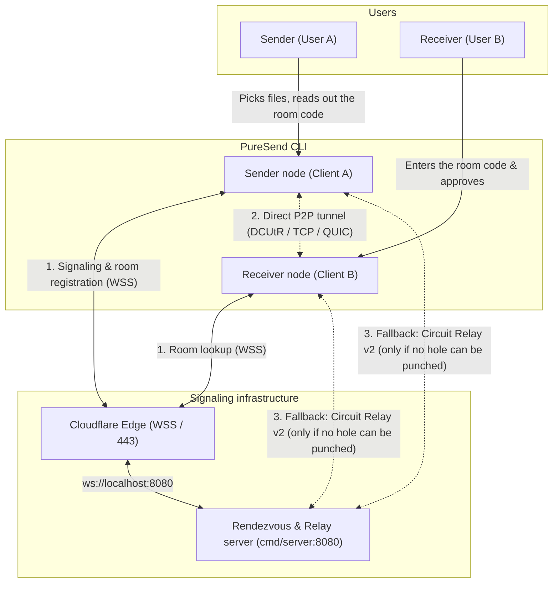
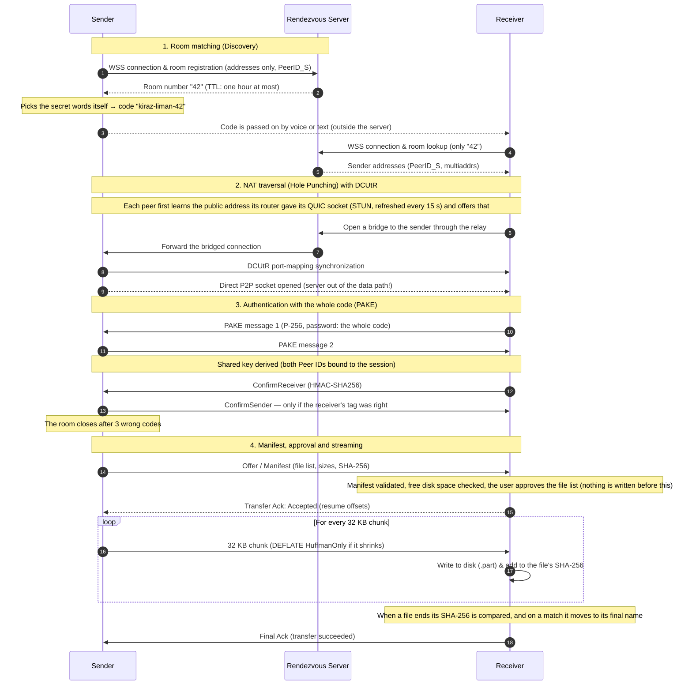
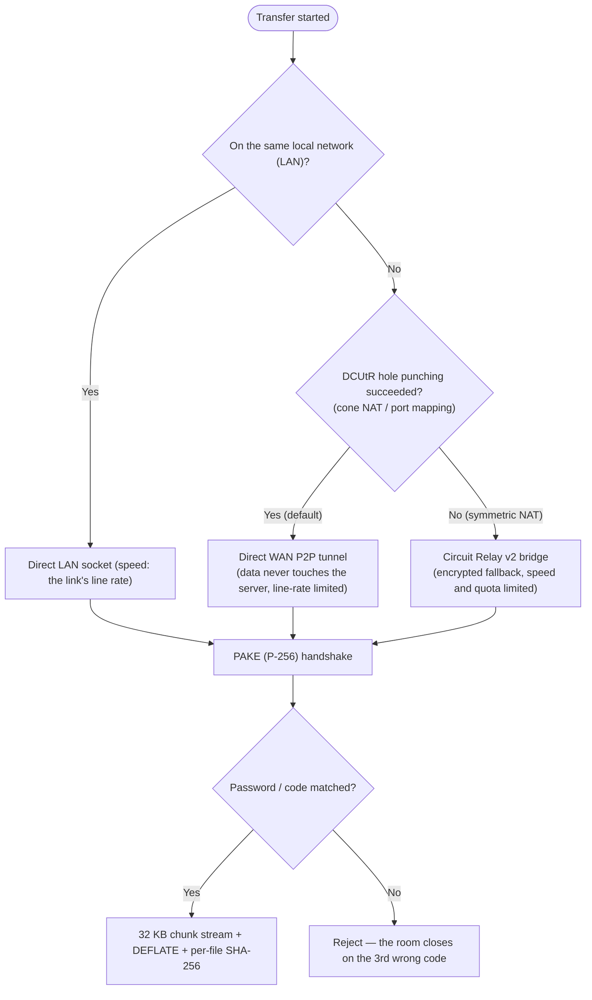

# PureSend — Architecture and Protocol Flow

[Türkçe](ARCHITECTURE_TR.md)

This document describes the network topology, the cryptography and the algorithm flow of PureSend's peer-to-peer (P2P) file transfer, with diagrams.

---

## 1. System and Network Topology

PureSend moves files straight from device to device, end to end encrypted, and stores nothing on a central server. The rendezvous server only introduces the two peers: it cannot see the files and never learns the secret words of a room code.

---

## 2. End-to-End Algorithm and Protocol Flow (Sequence Diagram)

The four stages of the PureSend protocol: signaling, NAT traversal, PAKE authentication, streaming.

---

## 3. Transport and Fallback Decision Tree (Traversal Flowchart)

How the route is chosen at runtime, depending on the connection:

---

## 4. Core Algorithm Principles

1. **An Untrusted Rendezvous Server:**
   * The handshake is the SPAKE2-style exchange of the `schollz/pake` library; it is not RFC 9382 SPAKE2 or CPace. The parts that carry the security (binding both identities to the key and the mutual confirmation tags) are the project's own code; the rationale is in `internal/transfer/auth.go`.
   * A room code has two parts. In `kiraz-liman-42`, `42` is the public room number (nameplate) that the server hands out; `kiraz-liman` is the secret part the sender chose itself (16 bits) and is never sent to the server.
   * The server cannot see file contents or file names. To put its own node in the sender's place, or to act as the receiver, it would have to guess the secret words: every attempt is a handshake, every failure is visible, and the sender closes the room after 3 wrong codes.
   * During the PAKE handshake the clients bind both Peer IDs into the key, so a peer carrying messages in between cannot join the two ends to each other.
2. **Constant-Memory Streaming ($O(1)$ RAM):**
   * Files are never loaded into memory. They are read in fixed 32 KB chunks, compressed with DEFLATE (`flate.HuffmanOnly`) if that makes them smaller, and sent as they are if it does not.
   * On the receiving side every chunk is added to the file's SHA-256 as it is written to disk; the digest is compared once, when the file ends.
3. **Resume:**
   * When a connection drops, the receiver tells the sender the size of the `.part` file in `.puresend-partial`; the transfer continues from the missing byte only.
   * The "I already have this file" answer is given only for files that an interrupted PureSend transfer finished; a sender cannot use it to probe the destination folder for other files.
4. **Filesystem Safety:**
   * Every path in an incoming manifest goes through the `safeJoin` check. Absolute paths (`/etc/passwd`), directory escapes (`../`), the reserved `.puresend-partial` folder and Windows device names (`CON`, `PRN`, `AUX`) are not repaired, they are rejected.
   * The destination cannot be the home folder itself or a folder above it; nothing is written through symbolic links in the destination; no existing file is overwritten.
